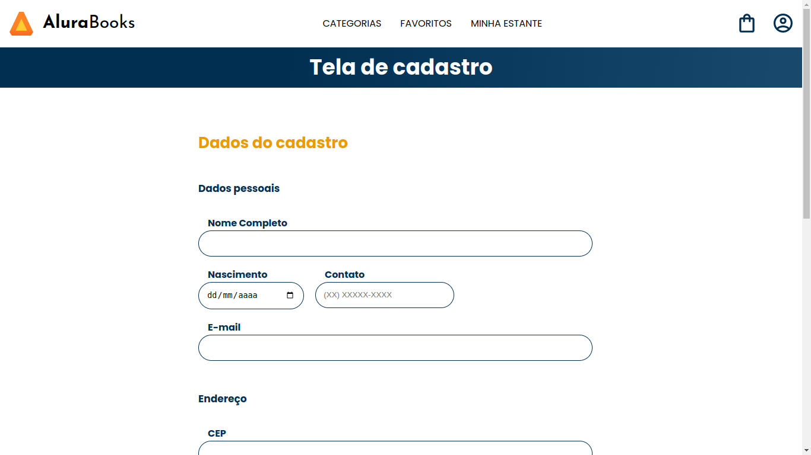
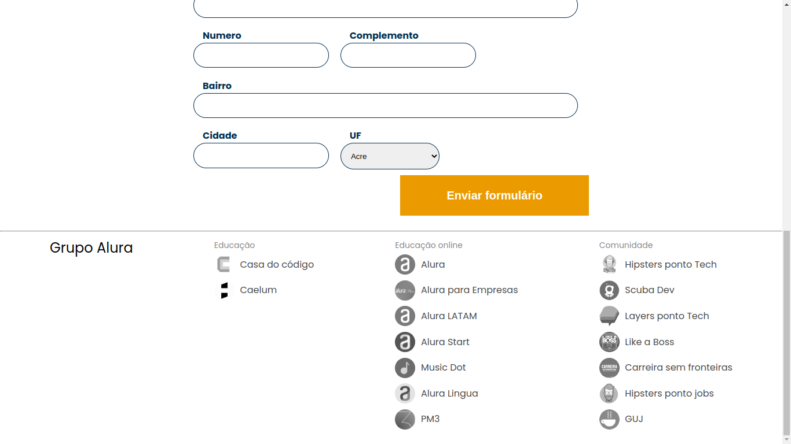

# Alura-Books

> Alura é uma plataforma de venda de livros técnicos. No formulário de cadastro do site, vai ser consumido a API do ViaCEP e quando o usuário for se cadastrar, vai ser adicionado automaticamente o nome da rua, da cidade e do estado no formulário.

### O que aprendi ao fazer o projeto: 

- [ ] JavaScript Síncrono e Assíncrono
- [ ] Event Loop e Call Stack
- [ ] Task Queue
- [ ] Call Backs
- [ ] Fetch API
- [ ] Promises
- [ ] Async Await
- [ ] Tratamentos de erros com Async
- [ ] Promise All

[⬆ Voltar ao topo](#Alura-Books) 